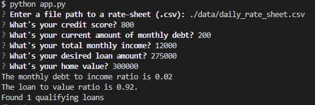

# Loan Qualifier Application

The Loan Qualifier Application is a python command line interface application that uses a daily rate sheet csv file to search for qualifying loans based on your credit score, monthly income, monthly debt, desired loan amount, and the home value. 

Currently in progress:

Addition of saving data to csv.

---

## Technologies

This project uses python 3.7 with these packages:

[fire](https://github.com/google/python-fire) - A library that automatically generates command line interfaces from any python object.

[questionary](https://github.com/tmbo/questionary) - A python library that adds pretty command line interfaces.

---

## Installation Guide

Both fire and questionary need to be installed prior to use.

```python
pip install fire
pip install questionary
```

---

## Usage

To use this application, clone the repository, insert your own daily_rate_sheet.csv, and run app.py by typing:

```python
python app.py
```
in a terminal that's within the working directory.



---

## Contributors

App creation by FinTech Bootcamp

App contribution towards csv data saver by Patrick B.

---

## License

MIT
